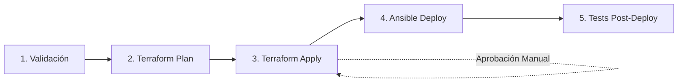

# ☁️ Azure Cloud Architecture: High Availability & Secure Deployment (TFG)

[](https://www.terraform.io/)
[](https://www.ansible.com/)
[](https://www.docker.com/)
[](https://azure.microsoft.com/)
[](https://dev.azure.com/)


Este repositorio contiene el **despliegue automatizado** de una infraestructura web en **Alta Disponibilidad** sobre **Microsoft Azure**. El proyecto aplica el paradigma de **Infraestructura como Código (IaC)**, **CI/CD automatizado** y principios de **hardening** para garantizar un entorno **seguro, escalable y reproducible**.

---

## 🏗️ Arquitectura del Proyecto

La solución se basa en una **arquitectura de tres capas** diseñada para eliminar puntos únicos de fallo (SPOF):

* **Capa de Acceso (Networking):** Un **Azure Load Balancer** distribuye el tráfico **HTTPS** de forma equitativa entre los nodos.
* **Capa de Aplicación (Compute):** Dos máquinas virtuales **Ubuntu 22.04** ejecutan **Docker** y están orquestadas con **Docker Compose**. Cada nodo cuenta con **Nginx** como *reverse proxy* y **WordPress** como aplicación.
* **Capa de Datos (PaaS):** Servicio gestionado **Azure Database for MySQL (Flexible Server)**, que aporta **persistencia**, **alta disponibilidad del servicio** y **copias de seguridad automáticas**.

---

## 🛠️ Stack Tecnológico

| Herramienta          | Función                                                                                      |
| -------------------- | -------------------------------------------------------------------------------------------- |
| **Terraform**        | Aprovisionamiento de red (VNET, subnets, NSG), máquinas virtuales y base de datos.           |
| **Ansible**          | Automatización de la configuración, hardening del sistema operativo e instalación de Docker. |
| **Docker Compose**   | Orquestación de contenedores (WordPress + Nginx).                                            |
| **Azure Key Vault**  | Gestión centralizada y segura de secretos y credenciales.                                    |
| **Azure Pipelines**  | CI/CD automatizado para validación, despliegue y testing ([ver detalles](#-cicd-con-azure-pipelines)).      |
| **Azure MySQL PaaS** | Base de datos gestionada con alta disponibilidad y copias de seguridad automáticas.         |

---

## 🔄 CI/CD con Azure Pipelines

El proyecto implementa un **pipeline completo de CI/CD** en **Azure DevOps** con **5 etapas secuenciales**:

### Pipeline de Despliegue



### Etapas del Pipeline

| Etapa | Descripción | Acciones |
|-------|-------------|----------|
| **1. Validación y Auditoría** | Verificación de seguridad y sintaxis | ✅ Security Audit<br>✅ Terraform Validation<br>✅ Ansible Validation |
| **2. Terraform Plan** | Previsualización de cambios | 📋 Genera plan de infraestructura<br>📤 Publica artifact para review |
| **3. Terraform Apply** | Despliegue de infraestructura | ⏸️ **Aprobación manual requerida**<br>🏗️ Aplica cambios en Azure<br>🔐 Usa Azure Key Vault |
| **4. Ansible Deploy** | Configuración de servidores | 🔧 Hardening del sistema<br>🐳 Despliegue de Docker<br>🌐 Configuración de WordPress |
| **5. Verificación Post-Deploy** | Tests de infraestructura | ✅ Health checks<br>📊 Resumen de deployment |

### Características del Pipeline

- ✅ **Validación automática** de código antes de despliegue
- ✅ **Aprobaciones manuales** en etapa de producción
- ✅ **Gestión segura de secretos** con Azure Key Vault
- ✅ **Rollback automático** en caso de fallo
- ✅ **Logs detallados** para debugging

**Documentación completa:** 
- [📘 Guía de Uso del Pipeline](PIPELINE.md)
- [⚙️ Configuración de Azure DevOps](CONFIGURACION_AZURE_DEVOPS.md)      |

---

## 🔒 Seguridad (Hardening por Diseño)

Para cumplir con los requisitos de seguridad del TFG, se han implementado las siguientes medidas:

1. **Gestión de secretos con Azure Key Vault:** Las credenciales sensibles (contraseñas de base de datos) se almacenan de forma segura en **Azure Key Vault** y se recuperan dinámicamente durante el despliegue con Ansible, eliminando por completo credenciales embebidas en código.
2. **Conexiones cifradas:** Comunicación obligatoria mediante **SSL/TLS** tanto en el acceso web (Nginx) como en la conexión con **Azure Database for MySQL**.
3. **Principio de mínimo privilegio:** **Network Security Groups (NSG)** configurados para permitir únicamente el tráfico necesario (**80**, **443** y **22**).
4. **Control de versiones seguro:** Archivos sensibles (`.tfvars`, `.tfstate`, `hosts.ini`, `.env`) excluidos del repositorio mediante `.gitignore`.

---

## 🚀 Guía de Despliegue

El proyecto soporta **dos métodos de despliegue**: **manual** (para desarrollo/testing) y **automatizado con Azure Pipelines** (recomendado para producción).

### 🔵 Método 1: Despliegue con Azure Pipelines (Recomendado)

**Prerequisitos:**
- Cuenta de Azure DevOps con parallelism grant aprobado
- Service Connection configurado para Azure
- Variable Group con credenciales configurado

**Pasos:**

1. **Configura Azure DevOps** siguiendo la [guía completa](CONFIGURACION_AZURE_DEVOPS.md)
2. **Ejecuta el pipeline** desde Azure DevOps
3. **Aprueba el deploy** cuando el pipeline se pause en la etapa de Terraform Apply
4. **Monitorea la ejecución** hasta completar las 5 etapas

**Ventajas:**
- ✅ Validación automática de seguridad
- ✅ Aprobaciones manuales antes de cambios en producción
- ✅ Logs centralizados y trazabilidad completa
- ✅ Rollback automático en caso de fallo

---

### 🟢 Método 2: Despliegue Manual (Desarrollo)

Por motivos de seguridad, los archivos con credenciales reales están excluidos del repositorio. Para replicar el entorno manualmente, sigue los pasos siguientes.

#### 0. Prerequisito: Generar Par de Claves SSH

```bash
# Generar par de claves SSH para Ansible
ssh-keygen -t rsa -b 4096 -f ~/.ssh/ansible_id_rsa

# Verificar que se crearon ambas claves
ls -lah ~/.ssh/ansible_id_rsa*
# Salida esperada:
# -rw-------  1 user user 3.2K ansible_id_rsa      (privada)
# -rw-r--r--  1 user user  738 ansible_id_rsa.pub  (pública)
```

#### 1. Configuración de Terraform

Crea el archivo `terraform/terraform.tfvars` basándote en [terraform/terraform.tfvars.example](terraform/terraform.tfvars.example):

```bash
cp terraform/terraform.tfvars.example terraform/terraform.tfvars
```

Edita el archivo y actualiza los valores:

```hcl
admin_username = "azureuser"
ssh_public_key = "ssh-rsa AAAAB3Nza...CONTENIDO_DE_ansible_id_rsa.pub"
location       = "France Central"
db_password    = "TuPasswordMySQL_Super_Seguro_456!"
```

> ⚠️ **IMPORTANTE:** La clave pública debe coincidir con `~/.ssh/ansible_id_rsa.pub`

Antes de ejecutar los *playbooks*, es necesario configurar dos archivos esenciales:

#### 2. Configuración de Ansible

##### 2.1 Archivo `ansible/ansible.cfg`

Crea el archivo `ansible/ansible.cfg` basándote en [ansible/ansible.cfg.example](ansible/ansible.cfg.example):

```bash
cp ansible/ansible.cfg.example ansible/ansible.cfg
```

Edita el archivo con las rutas absolutas correctas:

```ini
[defaults]
inventory = /ruta/absoluta/TFG_Infraestructura_Segura/ansible/inventory/hosts.ini
remote_user = azureuser
private_key_file = /home/tu_usuario/.ssh/ansible_id_rsa
host_key_checking = False
ask_pass = False
```

> ⚠️ **IMPORTANTE:** Usa rutas absolutas, no relativas

##### 2.2 Archivo `ansible/inventory/hosts.ini`

Crea el archivo `ansible/inventory/hosts.ini` basándote en [ansible/inventory/hosts.ini.example](ansible/inventory/hosts.ini.example):

```bash
cp ansible/inventory/hosts.ini.example ansible/inventory/hosts.ini
```

Actualiza las direcciones IP de las máquinas virtuales (obtenidas de la salida de Terraform):

```ini
[wordpress_servers]
vm-prod-1 ansible_host=20.199.123.45 ansible_user=azureuser ansible_ssh_private_key_file=/home/tu_usuario/.ssh/ansible_id_rsa
vm-prod-2 ansible_host=20.199.123.46 ansible_user=azureuser ansible_ssh_private_key_file=/home/tu_usuario/.ssh/ansible_id_rsa

[all:vars]
ansible_python_interpreter=/usr/bin/python3
```

> ⚠️ **IMPORTANTE:** Las IPs se obtienen después de ejecutar Terraform

#### 3. Despliegue de Infraestructura con Terraform

```bash
cd terraform

# Inicializar Terraform
terraform init

# Previsualizar cambios
terraform plan

# Aplicar infraestructura (esto creará recursos en Azure)
terraform apply

# Guardar las IPs públicas de las VMs (necesarias para Ansible)
terraform output vm_public_ips
```

#### 4. Configuración de Servidores con Ansible

Una vez que Terraform haya creado la infraestructura, actualiza el archivo `hosts.ini` con las IPs públicas y ejecuta:

```bash
cd ../ansible

# Verificar conectividad
ansible -i inventory/hosts.ini all -m ping

# Ejecutar playbook completo
ansible-playbook -i inventory/hosts.ini site.yml
```

El playbook realizará automáticamente:
1. ✅ Hardening del sistema operativo
2. ✅ Instalación de Docker y Docker Compose
3. ✅ Recuperación de secretos desde Azure Key Vault
4. ✅ Generación de certificados SSL
5. ✅ Despliegue de contenedores (Nginx + WordPress)
6. ✅ Configuración de WordPress con MySQL PaaS

#### 5. Verificación del Despliegue

Al finalizar, la aplicación estará disponible en:

```
https://<IP_PUBLICA_LOAD_BALANCER>
```

Puedes obtener la IP del Load Balancer con:

```bash
cd terraform
terraform output load_balancer_public_ip
```

---

## 📋 Variables de Entorno y Configuración

### Variables de Terraform

Todas las variables se definen en `terraform/terraform.tfvars` (ver [ejemplo](terraform/terraform.tfvars.example)):

| Variable | Descripción | Ejemplo |
|----------|-------------|---------|
| `admin_username` | Usuario administrador de las VMs | `azureuser` |
| `ssh_public_key` | Clave SSH pública para acceso | `ssh-rsa AAAAB3...` |
| `location` | Región de Azure | `France Central` |
| `db_password` | Contraseña de MySQL (se guarda en Key Vault) | `SuperSecure123!` |

### Variables de Ansible

Gestionadas automáticamente por el playbook, recuperadas desde Azure Key Vault:

- `WORDPRESS_DB_HOST`: Host de Azure MySQL
- `WORDPRESS_DB_USER`: Usuario de base de datos
- `WORDPRESS_DB_PASSWORD`: Contraseña (desde Key Vault)
- `WORDPRESS_DB_NAME`: Nombre de la base de datos

---

## � Documentación Adicional

### Guías Técnicas

- 📘 **[Pipeline de CI/CD](PIPELINE.md)** - Uso y funcionamiento del Azure Pipeline
- ⚙️ **[Configuración de Azure DevOps](CONFIGURACION_AZURE_DEVOPS.md)** - Setup completo paso a paso
- 🔐 **[Gestión de Secretos con Key Vault](docs/KEYVAULT.md)** - Best practices de seguridad

### Archivos de Ejemplo

Todos los archivos sensibles tienen su correspondiente `.example`:

- `terraform/terraform.tfvars.example` → Variables de infraestructura
- `ansible/ansible.cfg.example` → Configuración de Ansible
- `ansible/inventory/hosts.ini.example` → Inventario de servidores
- `ansible/deploy/.env.example` → Variables de Docker Compose

### Estructura del Proyecto

```
TFG_Infraestructura_Segura/
├── terraform/                    # Infraestructura como Código
│   ├── main.tf                  # Recursos principales de Azure
│   ├── variables.tf             # Definición de variables
│   ├── providers.tf             # Configuración de providers
│   └── terraform.tfvars.example # Plantilla de valores (NO commitear el real)
├── ansible/                      # Configuración y Automatización
│   ├── site.yml                 # Playbook principal
│   ├── ansible.cfg.example      # Plantilla de configuración
│   ├── inventory/               
│   │   └── hosts.ini.example    # Plantilla de inventario
│   ├── playbooks/               # Playbooks específicos
│   │   ├── install_docker.yml   # Instalación de Docker
│   │   ├── setup_firewall.yml   # Configuración de UFW
│   │   └── deploy_wordpress.yml # Despliegue de WordPress
│   └── deploy/                  # Archivos de despliegue
│       ├── docker-compose.yml   # Definición de servicios
│       ├── nginx/               # Configuración de Nginx
│       └── .env.example         # Plantilla de variables
├── azure-pipelines.yml          # Pipeline de CI/CD
├── PIPELINE.md                  # Documentación del pipeline
├── CONFIGURACION_AZURE_DEVOPS.md # Guía de setup
└── README.md                    # Este archivo

```

---

## 🔒 Consideraciones de Seguridad

### ⚠️ Archivos Sensibles (EN .gitignore)

**NUNCA** commitear estos archivos al repositorio:

- ❌ `terraform/terraform.tfvars` - Contiene credenciales
- ❌ `terraform/*.tfstate` - Estado de infraestructura (puede contener secretos)
- ❌ `ansible/ansible.cfg` - Rutas privadas del sistema
- ❌ `ansible/inventory/hosts.ini` - IPs y credenciales
- ❌ `ansible/deploy/.env` - Variables de entorno con secretos
- ❌ `~/.ssh/ansible_id_rsa` - Clave SSH privada

### ✅ Buenas Prácticas Implementadas

1. **Gestión de Secretos**: Todas las credenciales se almacenan en Azure Key Vault
2. **Cifrado en Tránsito**: TLS obligatorio para todas las conexiones
3. **Principio de Mínimo Privilegio**: NSGs restrictivos, solo puertos necesarios
4. **Autenticación SSH**: Sin contraseñas, solo claves SSH
5. **Pipeline con Aprobaciones**: Cambios en producción requieren aprobación manual
6. **Rotación de Secretos**: Keys y passwords gestionados centralizadamente

---

## 🎯 Roadmap Futuro

- [ ] Implementar monitorización con Azure Monitor
- [ ] Añadir Application Insights para WordPress
- [ ] Configurar Azure Front Door para CDN global
- [ ] Implementar backup automático de contenedores
- [ ] Añadir tests de integración automatizados
- [ ] Implementar disaster recovery plan

---

## 📌 Estado del Proyecto

Proyecto desarrollado como **Trabajo de Fin de Grado (TFG)**, enfocado en **cloud computing**, **automatización**, **CI/CD** y **seguridad en infraestructuras**.

### Arquitectura Final

```
                              Internet
                                 │
                                 ▼
                        Azure Load Balancer
                         (HTTPS - Puerto 443)
                                 │
                    ┌────────────┴─────────────┐
                    ▼                          ▼
               VM-Prod-1                  VM-Prod-2
           ┌──────────────┐          ┌──────────────┐
           │ Nginx (SSL)  │          │ Nginx (SSL)  │
           │ WordPress    │          │ WordPress    │
           │ Docker       │          │ Docker       │
           └──────┬───────┘          └──────┬───────┘
                  │                         │
                  └─────────┬───────────────┘
                            ▼
                    Azure MySQL PaaS
                  (Flexible Server HA)
                            │
                            ▼
                    Azure Key Vault
                   (Secretos y Certs)
```

### Tecnologías Clave

- ☁️ **Cloud**: Microsoft Azure
- 🏗️ **IaC**: Terraform 1.6.0
- ⚙️ **Config Mgmt**: Ansible 2.15+
- 🐳 **Containers**: Docker + Docker Compose
- 🔄 **CI/CD**: Azure DevOps Pipelines
- 🔐 **Secrets**: Azure Key Vault
- 🗄️ **Database**: Azure Database for MySQL (PaaS)
- 🌐 **Web Server**: Nginx + WordPress
- 🔒 **Security**: UFW, SSL/TLS, NSGs, SSH Keys

---

## 👨‍💻 Autor

**Miguel Ángel Torres López**  
📧 miguelangel.s463406@cesurformacion.com  
🎓 Administración de Sistemas Informáticos en Red (ASIR)  
🏫 CESUR Formación

---

## 📄 Licencia

Este proyecto es de uso educativo para el Trabajo de Fin de Grado (TFG).

---

**🚀 ¡Infraestructura lista para producción con un click!**
